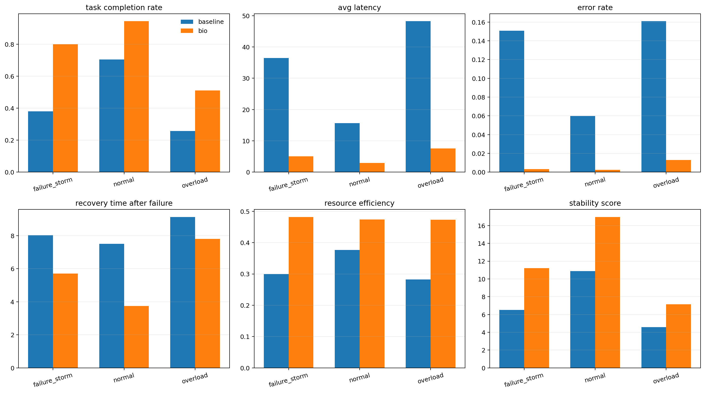
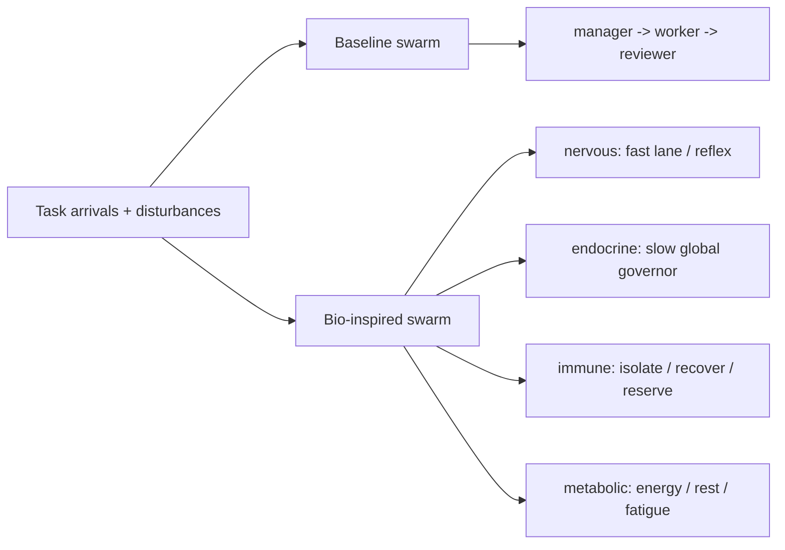
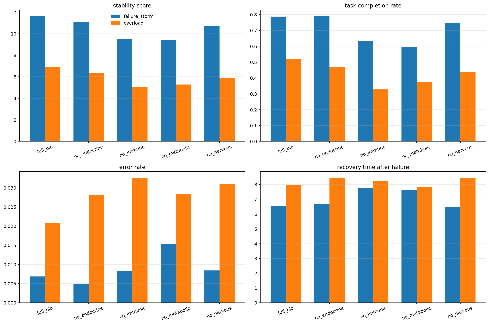

# HomeostasisBench

> A benchmark for stress-testing multi-agent systems under overload, failures, false signals, and resource collapse.

HomeostasisBench packages the current `bio_swarm_pilot` implementation as a reproducible benchmark and reference controller. Instead of asking whether a swarm can finish tasks in the happy path, it asks a harder question: does the system stay useful when agents fail, get tired, receive bad signals, and run with less budget?

The repository compares two systems in the same discrete-time environment:

- `baseline`: a classic `manager -> worker -> reviewer` hierarchy with assignment, retry, and simple review
- `bio-inspired`: the same task environment plus four explicit control layers: `nervous`, `endocrine`, `immune`, and `metabolic`



## Why This Is Interesting

Most multi-agent demos optimize best-case task completion. This project focuses on resilience:

- `nervous layer`: urgent fast lane, local reflex rerouting, immediate overload relief
- `endocrine layer`: slow global state variables such as `risk_level`, `stress_level`, and `resource_budget`
- `immune layer`: anomaly detection, quarantine, recovery, and reserve-agent substitution
- `metabolic layer`: energy, fatigue, context budget, rest, and recovery

The point is not the biological metaphor by itself. The point is to turn those ideas into measurable state, control logic, and recovery behavior that can be compared against a non-biological baseline.



## Current Results

The current optimized prototype is directionally strong:

| Scenario | System | Completion | Avg latency | Error rate | Recovery | Stability |
|:--|:--|--:|--:|--:|--:|--:|
| `normal` | baseline | 0.706 | 15.642 | 0.060 | 7.505 | 10.895 |
| `normal` | bio | 0.944 | 2.957 | 0.002 | 3.739 | 16.967 |
| `overload` | baseline | 0.257 | 48.222 | 0.161 | 9.131 | 4.584 |
| `overload` | bio | 0.512 | 7.589 | 0.013 | 7.802 | 7.166 |
| `failure_storm` | baseline | 0.380 | 36.488 | 0.151 | 8.036 | 6.531 |
| `failure_storm` | bio | 0.800 | 5.037 | 0.003 | 5.715 | 11.210 |

Layer ablation currently shows:

- strongest contributor: `immune layer`
- next strongest: `metabolic layer`
- smaller but positive contribution: `nervous layer`
- weakest but no longer harmful after retuning: `endocrine layer`



## Quickstart

```powershell
python -m venv .venv
.venv\Scripts\activate
pip install -e .
homeostasisbench --steps 140 --replicates 5 --seed 42 --output-dir bio_swarm_pilot/outputs
```

Alternative entrypoints:

```powershell
python -m bio_swarm_pilot
python -m bio_swarm_pilot.simulation --help
python -m unittest discover -s .\bio_swarm_pilot\tests -v
python .\examples\physio_swarm_demo.py
```

## What Gets Generated

The benchmark exports:

- scenario-level step metrics CSVs
- scenario-level summaries
- `aggregate_summary.csv`
- `summary_comparison.png`
- `stability_timeseries.png`
- layer ablation CSVs and figure
- `experiment_report.md`
- `bio-inspired-agent-swarm-prototype-hypothesis.md` when the acceptance gates pass

The main implementation lives in [`bio_swarm_pilot`](bio_swarm_pilot).

## Repo Structure

```text
bio_swarm_pilot/
  baseline_swarm.py
  bio_swarm.py
  metrics.py
  plots.py
  simulation.py
  outputs/
  tests/
docs/
  GITHUB_LAUNCH_PLAYBOOK.md
ROADMAP.md
```

## Positioning

This repository is best understood as:

- a benchmark for resilient multi-agent coordination
- a reference implementation of layered control in agent swarms
- a seed for future plug-in controllers, stronger baselines, public leaderboards, and a physiological swarm framework

It started as a benchmark first. The repository now also contains an early physiological swarm runtime and skill package under `physio_swarm/` and `skills/physio-swarm-protocol/`, but that layer is intentionally still minimal and protocol-first.

## Physiological Skill

The repository now includes a reusable skill and runtime for organism-style multi-agent design:

- runtime: `physio_swarm/protocol.py` and `physio_swarm/kernel.py`
- demo: `examples/physio_swarm_demo.py`
- skill: `skills/physio-swarm-protocol/SKILL.md`

## Next

- [ROADMAP.md](ROADMAP.md)
- [CONTRIBUTING.md](CONTRIBUTING.md)
- [GITHUB_LAUNCH_PLAYBOOK.md](docs/GITHUB_LAUNCH_PLAYBOOK.md)
- [bio_swarm_pilot/README.md](bio_swarm_pilot/README.md)
